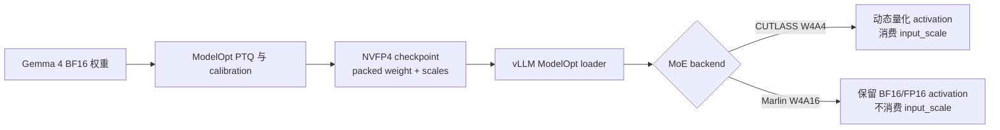
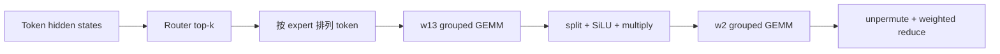
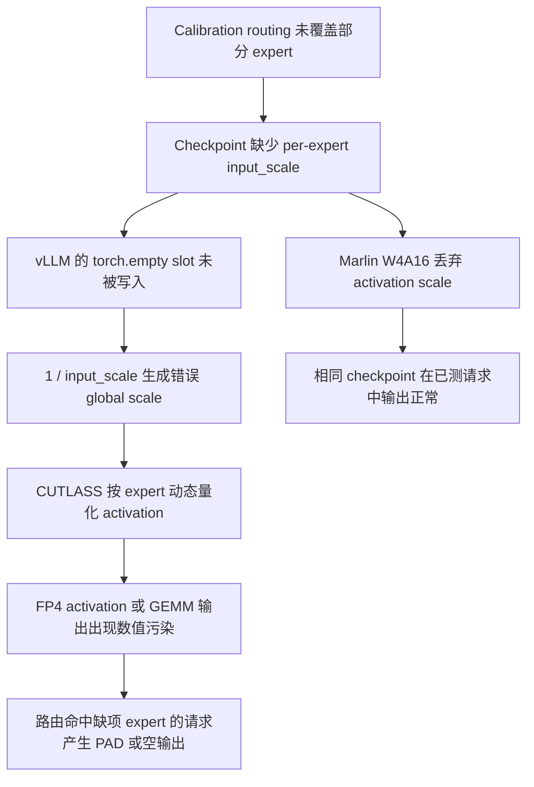

# Gemma 4 NVFP4 MoE 空输出：缺失 Expert Activation Scale 的传播链

> [!CAUTION]
> `bg-digitalservices/Gemma-4-26B-A4B-it-NVFP4` 在 vLLM 的 activation-quantized NVFP4 MoE 路径中可能返回 HTTP 200，同时生成 PAD token 或空内容。服务存活、吞吐率和响应状态均无法证明输出数值有效。

| 项目 | 结论 |
| --- | --- |
| 复现模型 | `bg-digitalservices/Gemma-4-26B-A4B-it-NVFP4` |
| 已确认环境 | RTX 5090 / SM120，vLLM `0.24.0`；Windows 首报，Linux 后续复现 |
| 触发路径 | 显式选择 `VLLM_CUTLASS` NVFP4 MoE，即 W4A4 expert computation |
| 可观测故障 | 请求耗尽 `max_tokens`，返回 PAD token、`content: null` 或空字符串 |
| checkpoint 缺陷 | 12 个 layer 中共有 25 个 expert scale slot 缺失；layer 0 缺少 expert `40、42、82、98` 的 activation `input_scale` |
| vLLM 缺陷 | per-expert scale 由 `torch.empty` 分配，加载结束后未验证完整性，W4A4 路径继续消费缺失 slot |
| 当前修复状态 | fail-fast 修复 [PR #45320](https://github.com/vllm-project/vllm/pull/45320) 截至 2026-08-27 仍处于开放状态 |

## 目录

- [结论摘要](#结论摘要)
- [术语与执行链](#术语与执行链)
- [量化位宽：W4A16、W8A8 与 W4A4](#量化位宽w4a16w8a8-与-w4a4)
- [NVFP4 的数值表示与两级 scale](#nvfp4-的数值表示与两级-scale)
- [从 Dense FFN 到 MoE 的 w13 与 w2](#从-dense-ffn-到-moe-的-w13-与-w2)
- [vLLM 中的 Linear 与 MoE backend](#vllm-中的-linear-与-moe-backend)
- [复现边界](#复现边界)
- [MoE checkpoint 的 scale 完整性](#moe-checkpoint-的-scale-完整性)
- [vLLM loader 如何放大缺项](#vllm-loader-如何放大缺项)
- [CUTLASS W4A4 中的数值污染](#cutlass-w4a4-中的数值污染)
- [Marlin 对照为何通过](#marlin-对照为何通过)
- [修复边界](#修复边界)

## 结论摘要

该故障由 checkpoint 完整性和 loader 完整性校验共同形成。ModelOpt 校准使用真实 MoE routing，部分低频 expert 未接收到 calibration token，相应 activation statistics 没有产生，导出的 checkpoint 因而缺少 per-expert `input_scale`。vLLM 为这些 scale 分配未初始化存储，只写入 checkpoint 中实际存在的项，随后直接构造 NVFP4 MoE kernel 配置。路由命中缺失 expert 时，错误 global scale 进入 activation FP4 量化，最终污染 MoE hidden state。

Linux SM120 复现报告确认 12 个 layer 共缺少 25 个 expert scale slot，并将 layer 0 的缺项定位为 `40、42、82、98`。同一报告验证 `VLLM_CUTLASS` 返回 48 个 PAD token，切换到 Marlin 后相同请求得到正确结果；相关证据记录于 [issue #51525 的 Linux 复现与根因评论](https://github.com/vllm-project/vllm/issues/51525#issuecomment-5229322893)。更早的 [issue #45212](https://github.com/vllm-project/vllm/issues/45212) 已观察到 affected expert 的 global scale 出现 `inf`，且 NaN 在第一个 MoE GEMM 输出中产生。

> [!IMPORTANT]
> NVFP4 W4A4 MoE 的加载不变量为：每个会被 activation-quantized backend 消费的 expert scale slot 均已加载，且值为正有限数。只验证 server 启动成功或少量 prompt 输出无法覆盖该不变量。

## 术语与执行链

本案例同时涉及 ModelOpt、NVFP4、checkpoint 与 GPU backend，四者处于不同抽象层。ModelOpt 负责后训练量化与模型导出；NVFP4 定义低精度数值及其缩放方式；checkpoint 保存 packed weight 和校准元数据；CUTLASS、FlashInfer 与 Marlin 在 vLLM 运行时执行具体 kernel。`--quantization modelopt` 告诉 vLLM 按 ModelOpt checkpoint schema 加载已经量化的参数，启动过程不会重新完成一次 PTQ 校准。

| 名称 | 所属层级 | 在本案例中的职责 |
| --- | --- | --- |
| NVIDIA ModelOpt | 量化工具与导出格式 | 以校准数据运行模型，生成 NVFP4 weight、weight scale 与 activation `input_scale` |
| NVFP4 | 数值与量化格式 | 规定 E2M1 FP4 数据、E4M3 block scale 和 FP32 global scale 的组合 |
| Hugging Face checkpoint | 持久化产物 | 保存量化权重、scale、模型配置与 tokenizer 文件 |
| vLLM ModelOpt loader | 参数装载与格式转换 | 将 checkpoint 字段写入 per-layer、per-expert tensor，并转换为 backend 所需 layout |
| MoE backend | 运行时执行实现 | 组织 token permutation、activation quantization、expert GEMM、activation 与结果归并 |



该模型的配置为 hidden size `2816`、`30` 个 transformer layer、MoE intermediate size `704`；每个 MoE layer 配置 `128` 个 expert，并为每个 token 选择 `8` 个 expert；总参数约 `25.2B`，单 token 激活参数约 `3.8B`。这些参数解释了缺项为何具有稀疏性：一次校准请求只覆盖各层 expert 集合的一小部分，低频 expert 需要更大且更多样的 calibration corpus 才能获得 activation statistics。模型说明见 [`bg-digitalservices/Gemma-4-26B-A4B-it-NVFP4`](https://huggingface.co/bg-digitalservices/Gemma-4-26B-A4B-it-NVFP4)。

> [!NOTE]
> ModelOpt、NVFP4 与 backend 可以分别变化。同一种 NVFP4 checkpoint 能由多个 backend 读取，同一个 backend 也可能支持多种量化格式；判断某个 scale 是否必需时，应沿当前 backend 的实际数据依赖追踪。

## 量化位宽：W4A16、W8A8 与 W4A4

`WnAm` 中的 `W` 表示 GEMM weight，`A` 表示进入 GEMM 的 activation，数字表示各自位宽。位宽本身不包含数值类型信息：`A8` 可能采用 INT8，也可能采用 FP8 E4M3；本案例中的 `W4A4` 明确采用 NVFP4 E2M1。模型层之间的 hidden state 通常仍以 BF16/FP16 保存，`A4` 描述 GEMM operand 在 kernel 边界处的表示形式。

| 执行方式 | Weight | GEMM activation | 主要 scale 依赖 | 本案例中的实现 |
| --- | --- | --- | --- | --- |
| W4A16 | 4-bit packed weight | BF16/FP16 | weight scale | Marlin |
| W8A8 | INT8 或 FP8 | 与 weight 配套的 INT8 或 FP8 | 取决于具体 INT8/FP8 schema | 背景对照 |
| NVFP4 W4A4 | E2M1 FP4 | runtime 动态生成的 E2M1 FP4 | weight scale 与 activation `input_scale` | VLLM_CUTLASS |

KV Cache 构成另一条独立量化轴。复现命令中的 `--kv-cache-dtype fp8` 只控制 attention 历史 K/V 的存储精度；它不决定 MoE GEMM 的 `A4/A16`，也不提供 `w13_input_scale` 或 `w2_input_scale`。因此 `NVFP4 W4A4 + FP8 KV Cache` 表示 expert GEMM 使用 FP4 weight 和 FP4 activation，同时 attention cache 使用 FP8 保存。

> [!IMPORTANT]
> 本案例的后端差分发生在 MoE activation 精度：CUTLASS 执行 W4A4，Marlin 执行 W4A16。FP8 KV Cache 在两个实验分支中保持不变，不能解释输出差异。

## NVFP4 的数值表示与两级 scale

NVFP4 使用 E2M1 FP4 表示数值主体，每 16 个元素共享一个 E4M3 FP8 block scale，并对整个 tensor 使用第二级 FP32 global scale。E2M1 含 1 个符号位、2 个指数位和 1 个尾数位，有限非负值集合为 `{0, 0.5, 1, 1.5, 2, 3, 4, 6}`。两级 scale 将局部块的相对分布与 tensor 的整体动态范围分开表示，NVIDIA 给出的结构可写为：

```text
x_i ≈ q_i,E2M1 × s_block(i),E4M3 × s_global,FP32
```

| 数据侧 | FP4 主体 | FP8 block scale | FP32 global scale |
| --- | --- | --- | --- |
| Weight | checkpoint 中的 packed E2M1 weight | checkpoint 中静态保存 | checkpoint 中的 `weight_scale_2` |
| Activation | runtime 从 BF16/FP16 动态生成 | runtime 按当前 routed activation 动态生成 | calibration 写入 checkpoint 的 `input_scale` |

weight 在部署前已经确定，因此 FP4 weight、block scale 和 global scale 可以一并写入 checkpoint。activation 由当前请求和 router 决策产生，vLLM 会在每次 expert GEMM 前生成 FP4 activation 与相应 block scale；离线校准保存的 `input_scale` 为这次动态量化提供 global range。block scale 只能表达 16 元素局部块内部的尺度，无法补回缺失或错误的 global calibration range。格式细节见 [NVIDIA NVFP4 技术说明](https://developer.nvidia.com/blog/introducing-nvfp4-for-efficient-and-accurate-low-precision-inference/)。

对一次 activation-quantized GEMM，可以把数据关系展开为：

```text
A ≈ Q_A × S_A,block × s_A,global
W ≈ Q_W × S_W,block × s_W,global

Y = A Wᵀ
  ≈ (Q_A × S_A,block) (Q_W × S_W,block)ᵀ
    × s_A,global × s_W,global
```

当前 checkpoint 缺少的是部分 expert 的 `s_A,global`，即 `input_scale`；现有证据没有显示同一批 expert 的 packed weight 或 weight scale 同时缺失。vLLM 内部使用 `a_gscale = 1 / input_scale` 构造量化映射，零值会生成 `inf`，未初始化内容则可能产生 NaN、负数或看似正常的有限垃圾值。

## 从 Dense FFN 到 MoE 的 `w13` 与 `w2`

现代 gated FFN 通常包含 gate、up 与 down 三个 projection。设输入 `X` 的 hidden size 为 `H`，intermediate size 为 `I`，其计算可以写成 `G = XW_gateᵀ`、`U = XW_upᵀ`、`Z = SiLU(G) ⊙ U`、`Y = ZW_downᵀ`。gate 与 up 共享输入，推理框架通常将两组权重沿输出维融合为 `gate_up [2I, H]`，一次 GEMM 产生两组结果，再执行 split、SiLU 和逐元素乘法。

MoE 在该结构上增加 expert 维。若共有 `E` 个 expert，融合后的权重可表示为 `w13 [E, 2I, H]` 和 `w2 [E, H, I]`；`w13` 对应 gate/up 融合矩阵，`w2` 对应 down projection。router 为每个 token 选择 top-k expert，expert `e` 实际接收的 token 数记为 `M_e`，运行时因而需要执行多组 `[M_e, H] × [2I, H]ᵀ` 与 `[M_e, I] × [H, I]ᵀ`。Grouped GEMM 将不同 `M_e` 的小矩阵计算组织到一次或少数几次 kernel launch 中。



量化不会改变上述逻辑 shape，却会增加 per-expert 元数据。每个 `w13[e]` 与 `w2[e]` 都有各自的 weight scale；W4A4 还要求相应的 activation global scale。校准阶段若从未把 token 路由给 expert `e`，该 expert 的权重仍然存在，而进入 `w13[e]` 或 `w2[e]` 的 activation statistics 可能为空，这正是 parameter coverage 与 calibration coverage 脱节的来源。

## vLLM 中的 Linear 与 MoE backend

vLLM 将常规量化 Linear GEMM 与 MoE expert computation 分成两个选择面。`--linear-backend` 服务于 attention 的 `qkv_proj/o_proj`、dense FFN 的 `gate_up/down` 等二维线性层；`--moe-backend` 服务于带 expert 维的计算，并可能联合处理 token permutation、activation quantization、两次 grouped GEMM、非线性激活与结果归并。当前 `KernelConfig` 将两者分别定义为 “quantized linear layer GEMM kernels” 与 “MoE expert computation kernels”，见 [`kernel.py` lines 235–280](https://github.com/vllm-project/vllm/blob/4a6a3272e8d75518efe0a6f9393eb504f3ed2ee0/vllm/config/kernel.py#L235-L280)。

| 配置 | 控制对象 | 当前案例中的观测 |
| --- | --- | --- |
| `--linear-backend cutlass` | 普通 quantized Linear | 失败与成功分支均可保持该值 |
| `--moe-backend cutlass` | vLLM CUTLASS expert computation | 进入 NVFP4 W4A4，消费 activation scale，复现空输出 |
| `--moe-backend marlin` | Marlin expert computation | 进入 weight-only W4A16，在已测请求中输出正确 |
| `--moe-backend auto` | 按模型与硬件选择 MoE backend | 原始 Windows 环境选择 `FLASHINFER_CUTLASS`，未进入报告中的失败路径 |

这一拆分使对照实验具有定位价值：保持模型、prompt、sampler、KV Cache 与 linear backend 不变，只替换 MoE backend，输出随 W4A4/W4A16 activation scale 消费关系改变。由此可以将故障范围收敛到 expert computation 及其量化元数据边界。

## 复现边界

原始报告在 native Windows、vLLM `0.24.0`、PyTorch `2.11.0+cu130`、CUDA 13.0 和 RTX 5090 Laptop 上显式设置 `--moe-backend cutlass`。失败请求返回 `finish_reason: "length"`，48 个 completion token 全部无有效文本；切换到 `--moe-backend marlin` 后，相同请求在 8 个 token 内输出正确答案。报告还发现低复杂度周期序列容易触发故障，保持 token 集合并打乱顺序后可以恢复，说明 token 顺序通过 router 决策改变 expert 命中集合。完整环境、请求和对照实验见 [issue #51525](https://github.com/vllm-project/vllm/issues/51525)。

复现命令同时指定 `--linear-backend cutlass`，两条实验分支只修改 MoE backend。其最小差分如下：

```diff
- --quantization modelopt --linear-backend cutlass --moe-backend cutlass
+ --quantization modelopt --linear-backend cutlass --moe-backend marlin
```

该问题具有明确的配置边界。原始环境中的 `auto` 选择了 `FLASHINFER_CUTLASS`，显式指定 `cutlass` 才进入 `VLLM_CUTLASS`；模型卡也要求使用 Marlin。Linux 复现排除了 Windows/WDDM 单平台因素，现有实验仍集中于该 Gemma 4 checkpoint、SM120 和 CUTLASS/Marlin 两个对照后端。其他 checkpoint、SM100 及所有 activation-quantized backend 的实际表现需要分别验证。

> [!NOTE]
> 输入文本只改变 MoE routing。周期序列、system role 和 prompt 长度均未被证明是 kernel 级触发条件；它们在已测请求中形成了命中缺失 expert 的不同路由模式。

## MoE checkpoint 的 scale 完整性

Gemma 4 MoE 的 gated FFN 可以抽象为 `w13 [E, 2I, H]` 与 `w2 [E, H, I]`，其中 `E` 为 expert 数量、`H` 为 hidden size、`I` 为单个 expert 的 intermediate size。`w13` 融合 gate/up projection，`w2` 执行 down projection。W4A4 execution 要求对应 activation global scale 覆盖每个可能被路由到的 expert：

```text
∀ e ∈ [0, E):
    isfinite(w13_input_scale[e]) ∧ w13_input_scale[e] > 0
    isfinite(w2_input_scale[e])  ∧ w2_input_scale[e]  > 0
```

校准阶段只会为实际激活的路径收集 activation statistics。公开诊断认为低频 expert 在校准集上从未被 router 选中，导出器因而没有写出对应 `input_scale` key。checkpoint 仍包含这些 expert 的量化 weight 和 weight block scale，字段数量却不足以支持 activation-quantized W4A4 inference。缺项统计、expert id 和 checkpoint 检查结果见 [Linux 根因评论](https://github.com/vllm-project/vllm/issues/51525#issuecomment-5229322893)。

## vLLM loader 如何放大缺项

截至 vLLM `main` 提交 [`4a6a3272e8d75518efe0a6f9393eb504f3ed2ee0`](https://github.com/vllm-project/vllm/commit/4a6a3272e8d75518efe0a6f9393eb504f3ed2ee0)，`ModelOptNvFp4FusedMoE.create_weights()` 对 `w13_weight_scale_2`、`w2_weight_scale_2`、`w13_input_scale` 和 `w2_input_scale` 均使用 `torch.empty` 分配存储，源码见 [`modelopt.py` lines 1507–1540](https://github.com/vllm-project/vllm/blob/4a6a3272e8d75518efe0a6f9393eb504f3ed2ee0/vllm/model_executor/layers/quantization/modelopt.py#L1507-L1540)。checkpoint loader 只会覆盖实际存在的 key，缺失 slot 保留 allocator 中的任意内容。

加载结束后，`process_weights_after_loading()` 直接把四组 scale 传入 backend format conversion，调用前没有完整性校验，源码见 [`modelopt.py` lines 1542–1579](https://github.com/vllm-project/vllm/blob/4a6a3272e8d75518efe0a6f9393eb504f3ed2ee0/vllm/model_executor/layers/quantization/modelopt.py#L1542-L1579)。普通 W4A4 backend 随后计算 `a1_gscale = 1 / a13_scale` 和 `a2_gscale = 1 / a2_scale`，见 [`nvfp4.py` lines 511–576](https://github.com/vllm-project/vllm/blob/4a6a3272e8d75518efe0a6f9393eb504f3ed2ee0/vllm/model_executor/layers/fused_moe/oracle/nvfp4.py#L511-L576)。零值会产生 `inf`；NaN、负数或任意有限垃圾值也会形成无效量化尺度。

> [!WARNING]
> 对 `torch.empty` 结果执行零值或 finite 检查无法确定 checkpoint key 是否加载。缺失 slot 可能碰巧包含正有限数。确定性检测需要先用 NaN sentinel 初始化，再在 backend conversion 和倒数计算前验证所有必需 slot。

## CUTLASS W4A4 中的数值污染

CUTLASS MoE 首先按 router 结果排列 token，再调用 `scaled_fp4_experts_quant(a, a1_gscale, ...)` 生成第一组 FP4 activation 与 block scale；第一个 expert GEMM 完成后，SiLU/mul 输出使用 `a2_gscale` 再次量化，随后进入 `w2` GEMM。两处 runtime quantization 均直接消费 per-expert global scale，源码见 [`cutlass_moe.py` lines 620–661](https://github.com/vllm-project/vllm/blob/4a6a3272e8d75518efe0a6f9393eb504f3ed2ee0/vllm/model_executor/layers/fused_moe/experts/cutlass_moe.py#L620-L661)。



这条链解释了 prompt dependence。路由没有命中缺项 expert 时，所有被消费的 scale 均有效，请求可以得到正常输出；命中任一缺项 expert 后，污染从对应 expert 的 activation quantization 进入 MoE 输出。服务端仍可完成 kernel launch、token loop 和 HTTP response，因此故障表现为静默正确性失效。

## Marlin 对照为何通过

Marlin 采用 NVFP4 W4A16 路径，weight 维持 FP4，activation 保持 BF16/FP16。vLLM 在 Marlin backend conversion 中把 `a13_scale` 与 `a2_scale` 设置为 `None`，随后构造仅包含 weight scale 的 W4A16 quant config，源码见 [`nvfp4.py` lines 448–467](https://github.com/vllm-project/vllm/blob/4a6a3272e8d75518efe0a6f9393eb504f3ed2ee0/vllm/model_executor/layers/fused_moe/oracle/nvfp4.py#L448-L467) 和 [`nvfp4.py` lines 539–550](https://github.com/vllm-project/vllm/blob/4a6a3272e8d75518efe0a6f9393eb504f3ed2ee0/vllm/model_executor/layers/fused_moe/oracle/nvfp4.py#L539-L550)。缺失 activation scale 因而不会进入 Marlin 计算。

> [!TIP]
> 对该 checkpoint 的现有部署应遵循模型卡要求并显式选择 Marlin，同时核对启动日志中的最终 MoE backend。该操作规避已确认的 scale 消费路径，无法补全 checkpoint，也无法替代后续准确率验证。

## 修复边界

| 层级 | 建议 | 正确性边界 |
| --- | --- | --- |
| checkpoint 生成 | 扩充 calibration coverage，确认全部 expert 均产生必需 scale；导出前校验 key 和 shape | 从源头恢复完整量化元数据 |
| vLLM loader | 用 NaN sentinel 初始化 checkpoint-loaded scale，在 format conversion 前校验正有限值并报告 parameter 与 expert id | 将静默污染转换为可操作的启动错误 |
| backend | 根据实际消费关系决定必需 scale；weight scale 始终校验，W4A16 backend 可跳过 activation scale | 避免对未消费字段施加错误约束 |
| 临时恢复 | 仅在显式启用时对缺失 activation scale 做统计量填充，并输出 repaired slot 与准确率警告 | 只能证明特定复现恢复，无法证明全模型精度 |

[PR #45320](https://github.com/vllm-project/vllm/pull/45320) 已实现 fail-fast 方案：四组 per-expert scale 使用 NaN sentinel 初始化，validator 在任何比较、倒数或 kernel-format conversion 前检查无效 expert row，并按 backend 消费关系豁免 activation scale。该 PR 报告 focused tests 通过，尚未合并；当前 `main` 快照仍保留 `torch.empty` 行为。具体实现建议与 median-repair 实验记录于 [issue #51525 的方案评论](https://github.com/vllm-project/vllm/issues/51525#issuecomment-5229382341)。

> [!IMPORTANT]
> 默认修复策略应为 fail-fast。缺失 activation scale 代表校准证据缺失；统计量填充只能作为显式、带警告的恢复模式，且需要独立的模型级准确率评估。缺失 weight scale 应直接拒绝加载。

## 结论

该案例展示了一类 MoE 量化特有的完整性风险：路由稀疏性会让 calibration coverage 与参数张量 coverage 脱节，checkpoint 仍可通过常规加载流程，错误只在 runtime 路由到特定 expert 后出现。W4A4 backend 对 activation global scale 的消费暴露了缺项，Marlin W4A16 对照则隔离了 scale 消费边界。可靠修复需要在 checkpoint 导出和 loader 两端建立 per-expert completeness invariant，并在 kernel 接触量化元数据前完成确定性验证。
